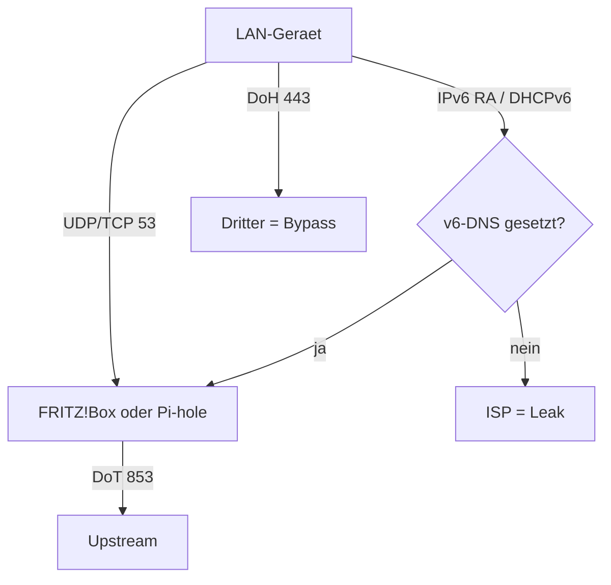
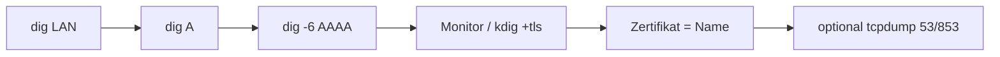

<!--
  Zweite Root-README. Keine details-Klappboxen.
  https://docs.github.com/en/get-started/writing-on-github/getting-started-with-writing-and-formatting-on-github/basic-writing-and-formatting-syntax
  https://docs.github.com/en/get-started/writing-on-github/working-with-advanced-formatting
  https://github.github.com/gfm/
-->

# FritzBoxBlacklist — Alternative README

<div align="center">

[](LICENSE)
[](review.md)
[](https://github.github.com/gfm/)

**Zweite** Root-Datei neben [`README.md`](README.md).
Zweck: Leitfaden plus GitHub-Syntax — und explizit die Features, die wir **nicht** nutzen.

[Bildungsweg](#bildungsweg) · [Quick Start](#quick-start) · [Anbieter](#anbieter) · [Tests](#tests) · [Markdown-Kniffe](#markdown-kniffe) · [Quellen](#quellen)

</div>

---

## Worum es hier geht

IPv4-DNS, IPv6-DNS, Router-DNS, Client-DNS, DoT, DoH und Filter sind **keine** gemeinsame Kontrollebene.

> [!IMPORTANT]
> Eine funktionierende IPv4-Aufloesung beweist **nicht**, dass Anfragen verschluesselt sind, und **nicht**, dass IPv6 denselben Resolver nutzt.

Historie: 500-Eintraege-Kindersicherung unter [`legacy/`](legacy/). Heute: verschluesselter Upstream plus optionaler Filter. Luecken und ROI: [`review.md`](review.md).

Auszeichnung: **fett**, *kursiv*, ***beides***, ~~verworfen~~, <ins>unterstrichen</ins>, <sub>tief</sub>, <sup>hoch</sup>. Tasten: <kbd>Internet</kbd> → <kbd>Zugangsdaten</kbd> → <kbd>DNS-Server</kbd>.

---

## Bildungsweg

| Stufe | Datei | Ziel |
| :---: | :--- | :--- |
| 0 | [Vanilla](docs/00-vanilla-dns.md) | Provider-DNS als Risiko |
| 1 | [Alternative DNS](docs/01-alternative-dns.md) | IPv4 **und** IPv6 |
| 2 | [Verschluesseln](docs/02-dns-verschluesselt.md) | DoT + Fallback |
| 3 | [Quick Start](docs/03-dns-verschluesselt-adblock.md) | Filter-Hostname bewusst |
| 4 | [Cloud](docs/04-cloud-adblocker.md) | Persoenlicher Hostname |
| 5 | [Self-Hosting](docs/05-selfhosting.md) | DHCP v4 **und** DNSv6/RA |
| 6 | [Testen](docs/06-testing.md) | TLS und IPv6 nachweisen |
| 7 | [Quellen](docs/07-sources.md) | Kuketz / PH / Operator |

Nebenpfad: [FRITZ!Box-Grundlagen](docs/fritzbox-basics.md), [Client-Setup](docs/manual-client-setup.md) nur bei derselben Policy-Ebene.

---

## Quick Start

1. `http://fritz.box` — **Erweiterte Ansicht**.
2. <kbd>Internet</kbd> → <kbd>Zugangsdaten</kbd> → <kbd>DNS-Server</kbd>
3. DNSv4 **und** DNSv6 setzen.
4. DoT an. Aufloesungsnamen: Hostname, z. B. `dnsforge.de`. Zwei Namen: `dnsforge.de;dns.quad9.net`
5. Online-Monitor: `(DoT verschluesselt)` fuer **beide** Familien.

> [!TIP]
> dnsforge.de = Filter + DE. `dns.digitale-gesellschaft.ch` = kein Filter, CH.

> [!WARNING]
> Kein `https://` und kein `/dns-query` im DoT-Feld.

> [!CAUTION]
> IPv6 aus ist eine Isolationsprobe von einer Minute, keine Dauerloesung.

- [x] IPv4 gesetzt
- [x] IPv6 gesetzt
- [x] DoT-Name gesetzt
- [ ] Monitor zeigt DoT v4+v6
- [ ] Browser-DoH zeigt nicht auf einen Dritten

---

## Kontrollebene



DoT auf der Box schuetzt den **Uplink**. DoH im Firefox kann die Haushaltspolitik verlassen.

---

## Anbieter

> [!NOTE]
> Stand **2026-09-05**. [Kuketz](https://www.kuketz-blog.de/empfehlungsecke/#dns), [Privacy-Handbuch 93d](https://www.privacy-handbuch.de/handbuch_93d.htm), dann Operator.

### Unzensiert

| Anbieter | IPv4 | IPv6 | DoT | Hinweis |
| :--- | :--- | :--- | :--- | :--- |
| Digitale Gesellschaft | `185.95.218.42` `185.95.218.43` | `2a05:fc84::42` `2a05:fc84::43` | `dns.digitale-gesellschaft.ch` | kein Filter |
| Digitalcourage | `5.9.164.112` | `2a01:4f8:251:554::2` | `dns3.digitalcourage.de` | nur DoT |
| ffmuc | `5.1.66.255` `185.150.99.255` | `2001:678:e68:f000::` `2001:678:ed0:f000::` | `dot.ffmuc.net` | nicht Digitalcourage |

### Mit Filter

| Anbieter | IPv4 | IPv6 | DoT | Filter |
| :--- | :--- | :--- | :--- | :--- |
| dnsforge.de | `176.9.93.198` `176.9.1.117` | `2a01:4f8:151:34aa::198` `2a01:4f8:141:316d::117` | `dnsforge.de` | Ads/Tracker |
| hard.dnsforge.de | `49.12.222.213` `88.198.122.154` | `2a01:4f8:c17:2c61::213` `2a01:4f8:c013:5ec0::154` | `hard.dnsforge.de` | streng |
| AdGuard Filter | `94.140.14.14` `94.140.15.15` | `2a10:50c0::ad1:ff` `2a10:50c0::ad2:ff` | `dns.adguard-dns.com` | Ads |
| AdGuard unfiltered | `94.140.14.140` `94.140.14.141` | `2a10:50c0::1:ff` `2a10:50c0::2:ff` | `unfiltered.adguard-dns.com` | keiner |
| Quad9 | `9.9.9.9` `149.112.112.112` | `2620:fe::fe` `2620:fe::9` | `dns.quad9.net` | Malware |

### Weitere

| Anbieter | IPv4 | IPv6 | DoT | Rolle |
| :--- | :--- | :--- | :--- | :--- |
| Mullvad unfiltered | `194.242.2.2` | `2a07:e340::2` | `dns.mullvad.net` | kein Filter |
| Mullvad base | `194.242.2.4` | `2a07:e340::4` | `base.dns.mullvad.net` | milde |
| Mullvad adblock | `194.242.2.3` | `2a07:e340::3` | `adblock.dns.mullvad.net` | Ads |
| dismail fdns1 | `116.203.32.217` | `2a01:4f8:1c1b:44aa::1` | `fdns1.dismail.de` | Ads, DE |
| Cloudflare | `1.1.1.1` `1.0.0.1` | `2606:4700:4700::1111` `2606:4700:4700::1001` | `one.one.one.one` | Speed, kein Privacy-Default |
| Google | `8.8.8.8` `8.8.4.4` | `2001:4860:4860::8888` `2001:4860:4860::8844` | `dns.google` | nicht fuer Datenschutz |

```diff
- Digitalcourage  5.1.66.255
+ Digitalcourage  dns3.digitalcourage.de / 5.9.164.112
+ ffmuc           dot.ffmuc.net / 5.1.66.255
- dnsforge        94.16.114.222
+ dnsforge        176.9.93.198 + IPv6
```

Zwei Familien sind Pflicht: nur IPv4 setzen heisst $A$ erledigt und $AAAA$ dem Provider ueberlassen.

```text
DoT != Logs   DoH != Logs   DNSSEC != Encryption
Filter != Privacy           DNS-Filter != IP-Block
```

---

## Tests

```bash
dig example.com
dig -6 AAAA example.com
kdig -d @dnsforge.de +tls-ca +tls-host=dnsforge.de example.com
```



`Resolve-DnsName` beweist **kein** TLS. Mehr: [Stufe 6](docs/06-testing.md).

---

## Self-Hosting

[Stufe 5](docs/05-selfhosting.md) Weg B braucht ULA, DNSv6 im Heimnetz, RA (RFC 5006), DoT/DoH vom Pi-hole, Gastnetz-Check.

---

## Markdown-Kniffe

| Feature | Syntax | Doku |
| :--- | :--- | :--- |
| Ueberschriften | `#` `##` `###` | Basic writing |
| Fett / kursiv / strike | `**` `*` `~~` | Basic + GFM |
| Quotes | `>` | Basic writing |
| Alerts | `NOTE` `TIP` `IMPORTANT` `WARNING` `CAUTION` | Basic writing |
| Tabellen | GFM tables | GFM spec |
| Tasklisten | `- [ ]` `- [x]` | GFM spec |
| Autolinks | nackte URLs | GFM spec |
| Fenced Code | `bash` `diff` `mermaid` | Advanced code blocks |
| Mermaid | fenced `mermaid` | Advanced diagrams |
| Math | `$A$` | Advanced math |
| Footnotes | `[^1]` | Basic writing |
| kbd sub sup ins | HTML-Inseln | Basic writing |
| Relative Links / Anker | `[Stufe 6](docs/06-testing.md)` `[Tests](#tests)` | Basic writing |
| HTML-Kommentar | unsichtbar im Render | Basic writing |

**Nicht genutzt:** `<details>` / `<summary>` ([Quickstart collapsed section](https://docs.github.com/en/get-started/writing-on-github/getting-started-with-writing-and-formatting-on-github/quickstart-for-writing-on-github#adding-a-collapsed-section)). Auch nicht: GeoJSON, TopoJSON, STL.

Vertrauensfrage als Fussnote.[^dns]

[^dns]: Der Resolver sieht QNAMEs auch hinter DoT. Kuketz: DNS ist immer eine Vertrauensfrage.

---

## Quellen

1. [Kuketz Empfehlungsecke — DNS](https://www.kuketz-blog.de/empfehlungsecke/#dns)
2. [Privacy-Handbuch 93d](https://www.privacy-handbuch.de/handbuch_93d.htm)
3. [GitHub Basic writing syntax](https://docs.github.com/en/get-started/writing-on-github/getting-started-with-writing-and-formatting-on-github/basic-writing-and-formatting-syntax)
4. [GitHub Advanced formatting](https://docs.github.com/en/get-started/writing-on-github/working-with-advanced-formatting)
5. [GFM Spec](https://github.github.com/gfm/)
6. [Creating diagrams](https://docs.github.com/en/get-started/writing-on-github/working-with-advanced-formatting/creating-diagrams)
7. [Code blocks](https://docs.github.com/en/get-started/writing-on-github/working-with-advanced-formatting/creating-and-highlighting-code-blocks)
8. [Mathematical expressions](https://docs.github.com/en/get-started/writing-on-github/working-with-advanced-formatting/writing-mathematical-expressions)
9. [`review.md`](review.md)
10. [`README.md`](README.md)
