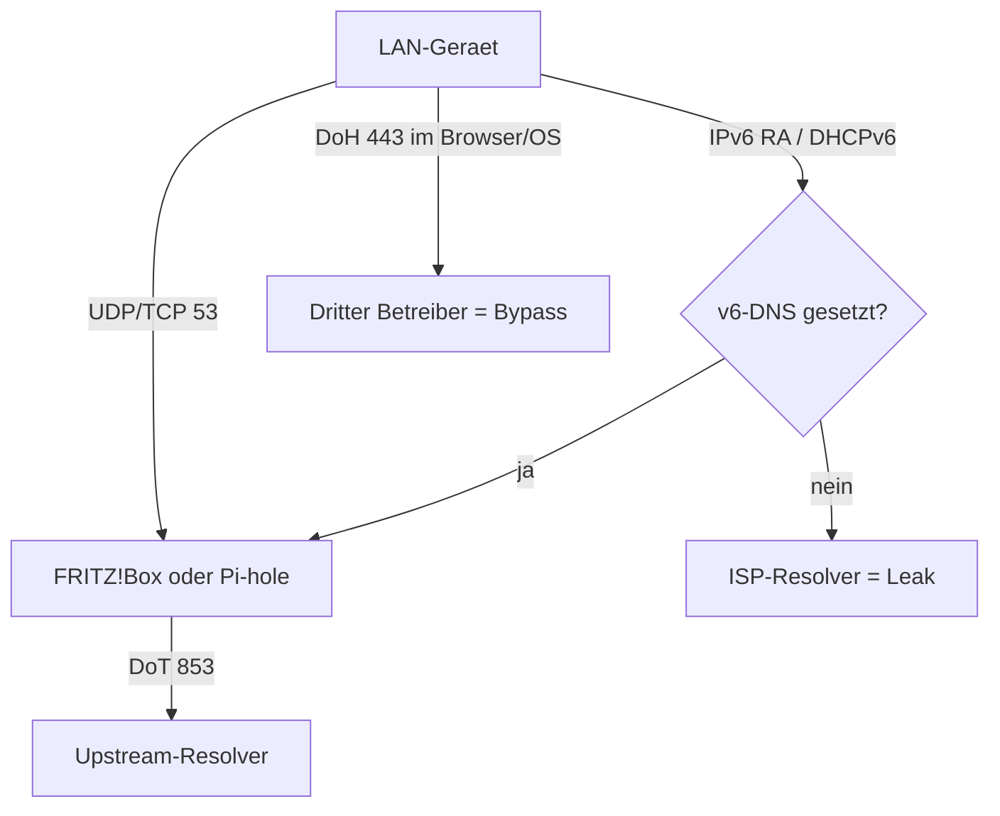
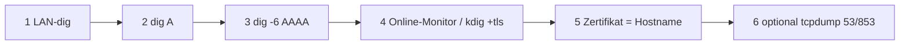

<!--
  Alternatives Root-README fuer grapefruit89/FritzBoxBlacklist.
  Keine details-Klappboxen.
  Syntax: GitHub Basic Writing, Advanced Formatting, GFM.
  Adressen Stand 2026-09-05 (Kuketz, Privacy-Handbuch, Betreiber).
-->

# FritzBoxBlacklist

<div align="center">

[](LICENSE)
[](#mitwirken)
[](#der-bildungsweg)

DNS-Sicherheit und Filterung fuer die FRITZ!Box — **dual-stack**, **DoT auf der Box**, Filter als eigene Entscheidung.

[Quick Start](#quick-start) · [Anbieter](#anbieter-kopieren-nicht-raten) · [Pruefen](#so-pruefst-du-ob-es-wirklich-sitzt) · [Quellen](#quellen)

</div>

---

## Worum es hier geht

Ein Leitfaden, der nicht nur sagt, *wo* du klickst, sondern *warum* eine Einstellung die andere nicht ersetzt.

IPv4-DNS, IPv6-DNS, Router-DNS, Client-DNS, DoT, DoH und Filterlisten sind **keine** gemeinsame Kontrollebene. Wer nur `1.1.1.1` eintraegt und IPv6 dem Provider ueberlaesst, hat das Netz nicht umgestellt — er hat die halbe Tabelle ausgefuellt.

> [!IMPORTANT]
> Eine funktionierende IPv4-Aufloesung beweist **nicht**, dass Anfragen verschluesselt sind, und **nicht**, dass IPv6 denselben Resolver nutzt.

Das urspruengliche Produkt war eine kurze Domainliste unter dem 500-Eintraege-Limit der Kindersicherung. Das bleibt unter [`legacy/`](legacy/) als Historie. Der aktuelle Weg ist: **verschluesselter Upstream plus optionaler Filter**, nicht das Abtippen von 500 Namen.

Die technische Review steht in [`review.md`](review.md).

---

## Der Bildungsweg

| Stufe | Dokument | Was du danach kannst |
| :---: | :--- | :--- |
| 0 | [Standard-DNS (Vanilla)](docs/00-vanilla-dns.md) | Den Provider-Resolver als Risiko benennen (Logs, CUII, Klartext). |
| 1 | [Alternative DNS](docs/01-alternative-dns.md) | IPv4 **und** IPv6 eines unabhaengigen Resolvers eintragen. |
| 2 | [DNS verschluesseln](docs/02-dns-verschluesselt.md) | DoT auf der FRITZ!Box aktivieren, Fallback verstehen. |
| 3 | [Quick Start Adblock](docs/03-dns-verschluesselt-adblock.md) | Einen *filternden* DoT-Hostnamen waehlen — bewusst, nicht "irgendwas mit Privacy". |
| 4 | [Cloud-Adblocker](docs/04-cloud-adblocker.md) | Persoenlichen Hostnamen (NextDNS, Control D, AdGuard) anbinden. |
| 5 | [Self-Hosting](docs/05-selfhosting.md) | Pi-hole / AdGuard Home per DHCPv4 **und** DNSv6/RA verteilen. |
| 6 | [Setup testen](docs/06-testing.md) | Verschluesselung und IPv6-Pfad *nachweisen*, nicht nur "Internet geht". |
| 7 | [Quellen](docs/07-sources.md) | Tabelle gegen Kuketz / Privacy-Handbuch / Operator halten. |

Zusaetzlich:

- [FRITZ!Box-Grundlagen](docs/fritzbox-basics.md) — Menuepfade IPv4, IPv6, DoT, DHCP
- [Manuelles Client-Setup](docs/manual-client-setup.md) — nur wenn derselbe Resolver wie im Heimnetz gilt

---

## Quick Start

Ziel in fuenf Minuten: **dieselbe Policy auf IPv4 und IPv6**, Transport **DoT**, Filter nur wenn du ihn willst.

1. FRITZ!Box oeffnen: `http://fritz.box`
2. Oben rechts **Erweiterte Ansicht** aktivieren.
3. Pfad: <kbd>Internet</kbd> → <kbd>Zugangsdaten</kbd> → <kbd>DNS-Server</kbd>
4. **Andere DNSv4-Server** und **Andere DNSv6-Server** setzen (siehe Tabelle unten).
5. **DNS-over-TLS** aktivieren. Feld *Aufloesungsnamen von sicheren DNS-Servern:* nur den Hostnamen, z. B. `dnsforge.de`. Mehrere Namen mit Semikolon: `dnsforge.de;dns.quad9.net`
6. Unverschluesseltes Fallback nur belassen, wenn Verfuegbarkeit wichtiger ist als immer TLS.
7. Kontrolle: <kbd>Internet</kbd> → <kbd>Online-Monitor</kbd> → *Genutzte DNS-Server* muss `(DoT verschluesselt)` fuer **v4 und v6** zeigen.

> [!TIP]
> Keine Theorie jetzt? Nimm **dnsforge.de** (Filter + DE) oder **dns.digitale-gesellschaft.ch** (kein Filter, CH). Beide gehoeren in v4-Feld, v6-Feld *und* DoT-Hostname.

> [!WARNING]
> Trage **keine** `https://`-URLs und keine Pfade wie `/dns-query` in das DoT-Feld.

- [x] IPv4-Resolver gesetzt
- [x] IPv6-Resolver gesetzt
- [x] DoT-Hostname gesetzt
- [ ] Online-Monitor zeigt DoT fuer beide Familien
- [ ] Browser-DoH zeigt *nicht* auf einen dritten Anbieter

---

## Eine Kontrollebene — nicht fuenf



| Ebene | Was sie steuert | Was sie *nicht* steuert |
| :--- | :--- | :--- |
| IPv4-DNS in der Box | DHCPv4-Clients | SLAAC-only Handys |
| IPv6-DNS + RA | Dual-Stack- und v6-Clients | Apps mit festem DoH |
| DoT auf der WAN-Seite | Uplink der Box | LAN-Mitschnitt, Gastnetz-Bypass |
| DoH im Browser | Dieses eine Profil | Den Rest des Haushalts |
| Filterliste / Pi-hole | Namen, die *dort* ankommen | Direkte IPs, DoH, Gast-SSID ohne Weg B |

> [!CAUTION]
> IPv6 "testweise deaktivieren" ist eine **Isolationsprobe von einer Minute**, keine Dauerloesung. Auf DS-Lite-Anschluessen ist IPv6 oft Pflicht.

DoT auf der Box und DoH im Firefox sind **nicht** austauschbar.

---

## Anbieter: kopieren, nicht raten

> [!NOTE]
> Werte vom **2026-09-05**, aus der [Kuketz-Empfehlungsecke](https://www.kuketz-blog.de/empfehlungsecke/#dns) und [Privacy-Handbuch Kap. 93d](https://www.privacy-handbuch.de/handbuch_93d.htm). Danach Betreiberseite. DNS bleibt eine Vertrauensfrage.

### Einstieg — unzensiert, ohne Werbefilter

| Anbieter | IPv4 | IPv6 | DoT-Name | DoH | Bemerkung |
| :--- | :--- | :--- | :--- | :--- | :--- |
| Digitale Gesellschaft (CH) | `185.95.218.42` `185.95.218.43` | `2a05:fc84::42` `2a05:fc84::43` | `dns.digitale-gesellschaft.ch` | `https://dns.digitale-gesellschaft.ch/dns-query` | Kein Filter. IPv6-Praefix am Operator pruefen. |
| Digitalcourage (DE) | `5.9.164.112` | `2a01:4f8:251:554::2` | `dns3.digitalcourage.de` | — | **Nur DoT**, kein DoH. |
| ffmuc / Freifunk Muenchen | `5.1.66.255` `185.150.99.255` | `2001:678:e68:f000::` `2001:678:ed0:f000::` | `dot.ffmuc.net` | `https://doh.ffmuc.net/dns-query` | Das ist **nicht** Digitalcourage. |

### Einstieg — mit Filter

| Anbieter | IPv4 | IPv6 | DoT-Name | DoH | Filter |
| :--- | :--- | :--- | :--- | :--- | :--- |
| dnsforge.de | `176.9.93.198` `176.9.1.117` | `2a01:4f8:151:34aa::198` `2a01:4f8:141:316d::117` | `dnsforge.de` | `https://dnsforge.de/dns-query` | Werbung / Tracker |
| dnsforge *hard* | `49.12.222.213` `88.198.122.154` | `2a01:4f8:c17:2c61::213` `2a01:4f8:c013:5ec0::154` | `hard.dnsforge.de` | `https://hard.dnsforge.de/dns-query` | Sehr streng |
| AdGuard (Filter) | `94.140.14.14` `94.140.15.15` | `2a10:50c0::ad1:ff` `2a10:50c0::ad2:ff` | `dns.adguard-dns.com` | `https://dns.adguard-dns.com/dns-query` | Werbung / Tracker |
| AdGuard (ohne Filter) | `94.140.14.140` `94.140.14.141` | `2a10:50c0::1:ff` `2a10:50c0::2:ff` | `unfiltered.adguard-dns.com` | `https://unfiltered.adguard-dns.com/dns-query` | Keiner |
| Quad9 | `9.9.9.9` `149.112.112.112` | `2620:fe::fe` `2620:fe::9` | `dns.quad9.net` | `https://dns.quad9.net/dns-query` | Malware / Phishing, kein Adblock |

### Weitere Hostnamen

| Anbieter | IPv4 | IPv6 | DoT-Name | Rolle |
| :--- | :--- | :--- | :--- | :--- |
| Mullvad *unfiltered* | `194.242.2.2` | `2a07:e340::2` | `dns.mullvad.net` | Kein Filter |
| Mullvad *base* | `194.242.2.4` | `2a07:e340::4` | `base.dns.mullvad.net` | Ads/Tracker milde |
| Mullvad *adblock* | `194.242.2.3` | `2a07:e340::3` | `adblock.dns.mullvad.net` | Ads/Tracker |
| dismail fdns1 | `116.203.32.217` | `2a01:4f8:1c1b:44aa::1` | `fdns1.dismail.de` | Ads/Tracker, DE |
| dismail fdns2 | `159.69.114.157` | `2a01:4f8:c17:739a::2` | `fdns2.dismail.de` | Ads/Tracker, DE |
| Cloudflare | `1.1.1.1` `1.0.0.1` | `2606:4700:4700::1111` `2606:4700:4700::1001` | `one.one.one.one` oder `cloudflare-dns.com` | Speed. Logs ~25 h. **Kein** Privacy-Default. |
| Google Public DNS | `8.8.8.8` `8.8.4.4` | `2001:4860:4860::8888` `2001:4860:4860::8844` | `dns.google` | Stabil. **Nicht** fuer Datenschutz. |

Hostnamen sind verschiedene *Produkte*. `194.242.2.2` ist nicht "Mullvad allgemein".

```diff
- Digitalcourage  5.1.66.255
+ Digitalcourage  5.9.164.112 / 2a01:4f8:251:554::2 / dns3.digitalcourage.de
+ ffmuc           5.1.66.255 / 185.150.99.255 / dot.ffmuc.net

- dnsforge        94.16.114.222
+ dnsforge        176.9.93.198 / 176.9.1.117 + IPv6 + dnsforge.de

- Cloudflare      Privacy-first in der Anfaengerzeile
+ Cloudflare      Speed-Option, kein Privacy-Default
```

```text
DoT            != keine Logs
DoH            != keine Logs
DNSSEC         != Verschluesselung
Verschluesselung != Malware-Filter
Malware-Filter != Werbeblocker
DNS-Filter     != Blockade direkter IPs
```

---

## So pruefst du, ob es wirklich sitzt

Gewoehnliches `dig example.com` zeigt nur, *wer auf Port 53 geantwortet hat*.

| Schicht | Frage | Werkzeug | Pass |
| :---: | :--- | :--- | :--- |
| 1 | Wer antwortet im LAN? | `dig example.com` / `nslookup` | Server ist die Box oder der Pi-hole |
| 2 | IPv4-Pfad | `dig A example.com` | derselbe Resolver |
| 3 | IPv6-Pfad | `dig -6 AAAA example.com` | **nicht** der ISP-Cache |
| 4 | Transport | Online-Monitor; `kdig +tls-ca +tls-host=...` | `(DoT verschluesselt)` |
| 5 | Zertifikat | dieselbe `kdig`-Zeile | Name = Aufloesungsname |
| 6 | Draht (optional) | `tcpdump -ni any 'port 53 or port 853'` | kein unerwartetes WAN-UDP/53 |

```bash
dig example.com
dig -6 AAAA example.com
kdig -d @dnsforge.de +tls-ca +tls-host=dnsforge.de example.com
```



> [!WARNING]
> `Resolve-DnsName` unter Windows beweist **kein** TLS.

Mehr: [Stufe 6](docs/06-testing.md).

---

## Self-Hosting ohne IPv4-Blindheit

[Stufe 5](docs/05-selfhosting.md) Weg B bleibt richtig — unvollstaendig, solange nur <kbd>IPv4-Konfiguration</kbd> dokumentiert ist.

1. Resolver eine **ULA** geben (`fd00::/8`).
2. Dieselbe Adresse unter <kbd>Heimnetz</kbd> → <kbd>Netzwerk</kbd> → <kbd>IPv6-Adressen</kbd> als **DNSv6-Server im Heimnetz** eintragen.
3. Ankuendigung per Router Advertisement (RFC 5006).
4. Upstream des Pi-hole / AdGuard Home per DoT/DoH.
5. Gastnetz extra pruefen.

---

## Legacy

Die Top-500-Listen liegen in [`legacy/`](legacy/). Sie sind **veraltet**. Das Limit von 500 gilt nur fuer die native FRITZ!Box-Liste.

---

## Mitwirken

1. Adressen nicht aus dem Gedaechtnis — Kuketz, Privacy-Handbuch, dann Operator.
2. Jede neue Tabellenzeile mit Datum.
3. IPv6 und DoT-Namen nicht in Stufe 2 nachreichen.
4. "IPv6 aus" nicht als Fix in Stufe 6 formulieren.

Review: [`review.md`](review.md).

### Schreibweise

- [GFM Spec](https://github.github.com/gfm/)
- [Basic writing syntax](https://docs.github.com/en/get-started/writing-on-github/getting-started-with-writing-and-formatting-on-github/basic-writing-and-formatting-syntax)
- [Advanced formatting](https://docs.github.com/en/get-started/writing-on-github/working-with-advanced-formatting)
- [Creating diagrams](https://docs.github.com/en/get-started/writing-on-github/working-with-advanced-formatting/creating-diagrams)
- [Code blocks](https://docs.github.com/en/get-started/writing-on-github/working-with-advanced-formatting/creating-and-highlighting-code-blocks)
- [Mathematical expressions](https://docs.github.com/en/get-started/writing-on-github/working-with-advanced-formatting/writing-mathematical-expressions)

**Nicht genutzt:** `<details>` / `<summary>`.

---

## Lizenz

[MIT License](LICENSE).

---

## Quellen

1. [Kuketz Empfehlungsecke, DNS](https://www.kuketz-blog.de/empfehlungsecke/#dns)
2. [Privacy-Handbuch 93d](https://www.privacy-handbuch.de/handbuch_93d.htm)
3. [GitHub Basic writing syntax](https://docs.github.com/en/get-started/writing-on-github/getting-started-with-writing-and-formatting-on-github/basic-writing-and-formatting-syntax)
4. [GitHub Advanced formatting](https://docs.github.com/en/get-started/writing-on-github/working-with-advanced-formatting)
5. [GFM Spec](https://github.github.com/gfm/)
6. Betreiberseiten der genutzten Resolver
